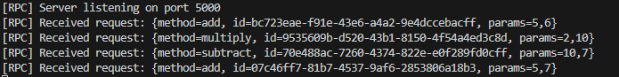

# RPC_Sockets_ARSW

Implementación de **Remote Procedure Call (RPC)** usando Sockets TCP en Java.

## Autores

- Carolina Cepeda Valencia
- Deisy Lorena Guzman Cabrales
- Jared Sebastian Farfan Guevara

---

## Estructura de Archivos

```
src/rpc/
├── CalculatorService.java      # Interfaz del servicio (contrato)
├── CalculatorServiceImpl.java  # Implementación real del servicio
├── CalculatorClientStub.java   # Stub del cliente (proxy remoto)
├── RpcProtocol.java            # Protocolo de serialización
├── RpcServer.java              # Servidor RPC
└── RpcClientMain.java          # Aplicación cliente interactiva
```

---

## Cómo Ejecutar

### Requisitos
- Java 11 o superior

### Compilación

```bash
cd src
javac rpc/*.java
```

### Ejecución

**1. Iniciar el Servidor (Terminal 1):**
```bash
cd src
java rpc.RpcServer
```

Salida esperada:
```
[RPC] Server listening on port 5000
```

**2. Iniciar el Cliente (Terminal 2):**
```bash
cd src
java rpc.RpcClientMain
```

---

## ¿Qué es RPC?

**RPC (Remote Procedure Call)** es un protocolo que permite a un programa ejecutar código en otra máquina remota como si fuera una llamada local. El cliente invoca métodos sin preocuparse por los detalles de la comunicación de red.

### Características principales:
- **Transparencia de ubicación**: El cliente no necesita saber dónde se ejecuta el código
- **Abstracción de red**: Los detalles de sockets, serialización y deserialización se ocultan
- **Modelo cliente-servidor**: Un servidor expone servicios que múltiples clientes pueden consumir

---

## Protocolo de Comunicación

El protocolo usa un formato de texto simple basado en pares `clave=valor` separados por `;`.

### Formato de Solicitud (Request)

```
method=<nombre_metodo>;id=<uuid>;params=<param1>,<param2>
```

**Ejemplo:**



### Formato de Respuesta (Response)

```
id=<uuid>;ok=false;result=<result>
```

**Ejemplos:**


---

## Flujo de Funcionamiento

### Pasos del Proceso

1. **El cliente** llama a `calc.add(10, 5)` como si fuera local
2. **El Stub** intercepta la llamada y:
   - Genera un UUID único para la petición
   - Serializa el método y parámetros en formato de protocolo
   - Abre conexión TCP al servidor
   - Envía la solicitud
3. **El Servidor** recibe la solicitud y:
   - Parsea el mensaje usando `RpcProtocol`
   - Ejecuta el método `dispatch()` para llamar al servicio real
   - Construye la respuesta con el resultado
4. **El Stub** recibe la respuesta y:
   - Verifica que el ID coincida
   - Extrae el resultado o lanza excepción si hay error
5. **El cliente** recibe el resultado `15` de forma transparente

---

### Diagrama de Secuencia

```
  Cliente                  Stub                   Servidor              Servicio
     │                       │                        │                     │
     │  calc.add(10, 5)      │                        │                     │
     │──────────────────────▶│                        │                     │
     │                       │                        │                     │
     │                       │  Serializa:            │                     │
     │                       │  "id=xxx;method=add;   │                     │
     │                       │   params=10,5"         │                     │
     │                       │                        │                     │
     │                       │  Socket TCP            │                     │
     │                       │───────────────────────▶│                     │
     │                       │                        │                     │
     │                       │                        │  dispatch("add")    │
     │                       │                        │────────────────────▶│
     │                       │                        │                     │
     │                       │                        │      return 15      │
     │                       │                        │◀────────────────────│
     │                       │                        │                     │
     │                       │  "id=xxx;ok=true;      │                     │
     │                       │   result=15"           │                     │
     │                       │◀───────────────────────│                     │
     │                       │                        │                     │
     │                       │  Deserializa           │                     │
     │       return 15       │                        │                     │
     │◀──────────────────────│                        │                     │
     │                       │                        │                     │
```
